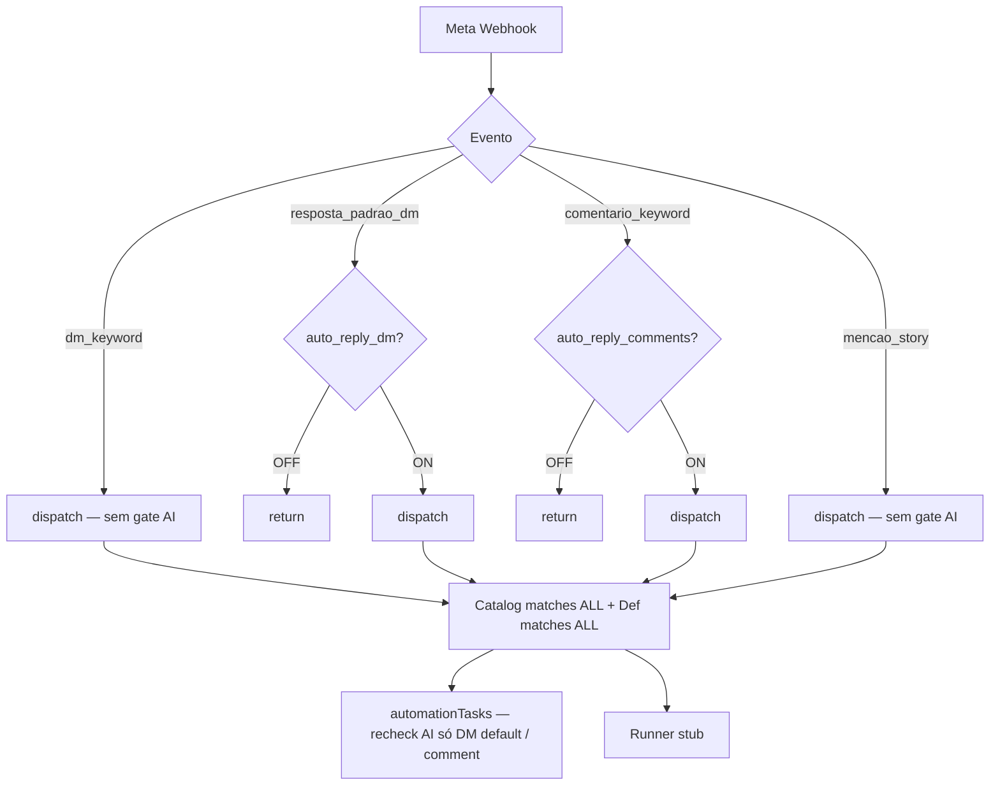
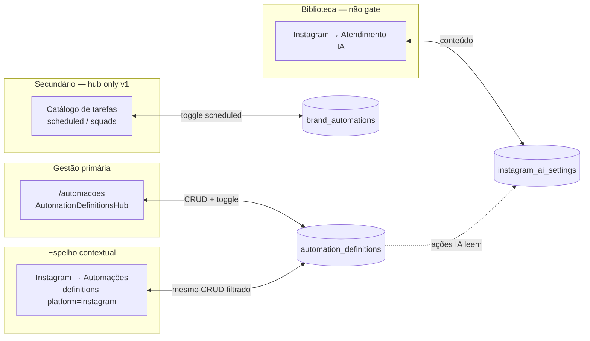
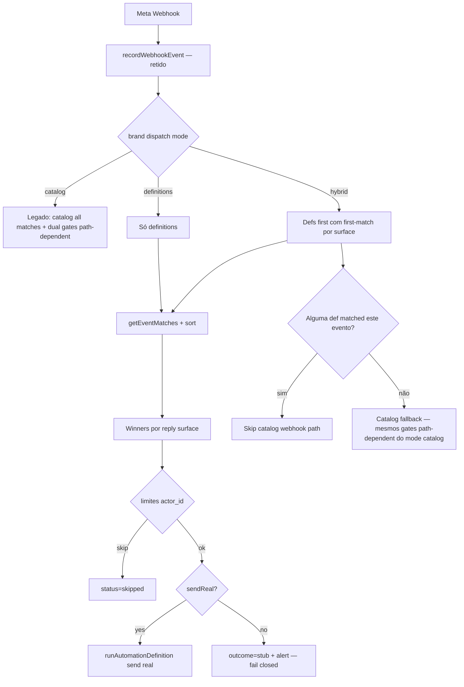

# LeadCapture — Reestruturação de Automações (SoT, Seeds, Mirror Instagram)

| Campo | Valor |
|---|---|
| **Título** | Distribuição, estruturação e consolidação de automações event-driven (Instagram) |
| **Autor** | Engineering / Architecture (LeadCapture) |
| **Data** | 2026-07-09 |
| **Status** | Draft (Rev. 3 — pós re-review) |
| **Escopo** | Product + Architecture (sem implementação nesta fase) |
| **Rotas-alvo** | `/automacoes` (primária), Instagram → Automações (espelho), Instagram → Atendimento IA (biblioteca) |
| **Foco de envio real nesta iniciativa** | Apenas `enviar_dm_ig` e `comentar_ig` |

---

## Overview

Hoje o LeadCapture opera **quatro sistemas paralelos** de automação. O caminho de produção de respostas Instagram depende, em **parte** dos eventos, de um **dual gate** confuso: automação do catálogo (`brand_automations.status = active`) **e**, em default DM / comentários, interruptor global (`instagram_ai_settings.auto_reply_dm | auto_reply_comments`). Na UI, Atendimento IA parece “ligar respostas automaticamente” — modelo **indesejado** pelo product owner.

A proposta: consolidar event-driven IG em **uma automação = uma ação individual** (gatilho + pipeline + limites + toggle `ativa`). O toggle é a **única** decisão de “responde ou não”. **`/automacoes`** é source of truth; a aba Automações do Instagram **espelha** os mesmos records (filtro definitions-only) e reutiliza o mesmo modal. Seeds inativos para novos perfis. Persona/FAQ = **biblioteca**, não master on/off.

**Regra de ouro de deploy (anti double-send):**  
**Nunca colocar envio real no definition runner em produção enquanto o dispatcher ainda multi-dispara catalog + definitions em paralelo para o mesmo evento.** Send real só sobe no mesmo release que introduce hybrid first-match / skip-catalog-when-def-matched **ou** após catalog webhook slugs pausados por brand.

---

## Background & Motivation

### Estado atual (codebase)

| Sistema | Persistência | UI principal | Runtime IG webhook | Envio real |
|---|---|---|---|---|
| **automation_definitions** | `automation_definitions` + `automation_definition_runs` | `AutomationDefinitionsHub` + `AutomationDetailModal` (Geral/Gatilho/Ações/Limites/Histórico) | `getEventMatches` + `runAutomationDefinition` | **Stub** — não chama `sendDm` / `replyToComment` |
| **brand_automations catalog** | `automation_catalog` + `brand_automations` | Toggle em `AutomationsPage` (Catálogo) e `InstagramAutomationsTab` | Match `catalog_slug` + `config.trigger_event` | **Produção** em `automationTasks` |
| **CRM automations** | `crm_automation_rules` | Sequences lead WhatsApp | N/A IG | WhatsApp |
| **flow_automations** | grafo | `/fluxos` | Separado | Separado |

**Dispatcher hoje** (`instagramEventDispatcher.ts`): para cada evento, executa **todos** os catalog matches **e depois todos** os definition matches — **sem first-match**. Definitions “ok: true” sem send real → risco latente de double-send no dia em que o runner for wired sem reordenar o dispatch.

### Dual gate — tabela por evento (estado real)

O diagrama “gate global sempre” **não** descreve o runtime atual. Comportamento **path-dependent**:

| Evento / path | Early-return `auto_reply_*` em `metaWebhook`? | Recheck em `automationTasks`? | Catalog slug típico | Definitions hoje |
|---|---|---|---|---|
| `dm_keyword` | **Não** (~191–203) | N/A (sem slug catalog keyword) | **Nenhum** — catálogo só tem `ig-webhook-dm-reply` com `trigger_event: resposta_padrao_dm` | Path definitions se houver def ativa |
| `resposta_padrao_dm` | **Sim** — `auto_reply_dm` (~206–210) | **Sim** em `instagramWebhookDmReply` | `ig-webhook-dm-reply` | Stub se def ativa |
| `comentario_keyword` | **Sim** — `auto_reply_comments` (~274–279) | **Sim** em `instagramWebhookCommentReply` | `ig-webhook-comment-keyword` (`reply_mode` dm\|comment) | Stub se def ativa |
| `mencao_story` (messaging share / mentions) | **Não** (~174–188 e change path) | **Não** em `instagramWebhookMentionThanks` | `ig-webhook-mention-thanks` | Stub se def ativa |
| `novo_seguidor` | N/A (log only, sem dispatch seed) | — | — | — |

Outros fatos:

1. **`syncAiAutomations`**: só **ativa** `ig-webhook-dm-reply` / `ig-webhook-comment-keyword` quando toggles ON; **não pausa** quando OFF.
2. **`InstagramAiTab`**: toggles parecem master; copy de “produção” reforça confusão.
3. **Seeds** `POST /api/instagram/automations/seed`: **ativam** 7 slugs (incl. 3 webhooks + monitors agendados); não semeiam definitions; não no OAuth.
4. **Remover early-returns** continua correto no produto; a **superfície de mudança** é maior para mentions/keywords (já sem gate AI) do que para default DM/comments (hoje gated).



Arquivos-chave: `AutomationsPage.tsx`, `components/automations/*`, `InstagramAutomationsTab.tsx`, `InstagramAiTab.tsx`, `automationDefinitions.ts`, `automationDefinitionRunner.ts`, `brandAutomations.ts`, `automationTasks.ts`, `instagramEventDispatcher.ts`, `instagram.ts`, `metaWebhook.ts`, `routes/instagram.ts`.

### Motivação de produto (PO)

- Criar e **testar cada automação** individualmente.
- Seeds para novos perfis: **pequena edição + ativação**.
- Responder DM/comentário **somente** se a automação estiver **ativa**.
- Gestão primária em **Automações**; espelho no Instagram.
- Pós-aprovação: testes um a um (DM, comentário, …).

---

## Goals & Non-Goals

### Goals

1. Modelo canônico: gatilho + pipeline + limites + `ativa` como único gate de reply.
2. SoT event-driven IG: `automation_definitions` (`/api/automation-defs`).
3. Remover dual gate de produto/runtime (toggles globais e early-returns path-dependent).
4. IA settings = biblioteca compartilhada.
5. Espelho Instagram R/W definitions-only + mesmo modal/handlers.
6. Seed pack idempotente (`ativa: false`); OAuth + CTA.
7. Runner real **somente** para `enviar_dm_ig` / `comentar_ig`, sob flag de dispatch segura.
8. Limites com `actor_id` queryable + semântica de janela definida.
9. Migração com matriz por slug, audit log, flag **por brand**.
10. PR plan ordenado anti double-send + matriz de testes.

### Non-Goals

- Reescrever `crm_automation_rules` ou `/fluxos` (`flow_automations`).
- Migrar tasks **agendadas** do catálogo (squads, health, performance report, etc.) para definitions.
- Implementar envio real de `enviar_dm_wa`, `notificar_equipe`, `enviar_email`, `publicar_conteudo` nesta iniciativa (permanecem stub / framework).
- Multi-conta Instagram por brand.
- Redesign visual completo da página Automações.
- E2E automatizado nesta fase de design (só matriz).

### In-scope action types (envio real)

| Tipo | In-scope envio real? |
|---|---|
| `enviar_dm_ig` | **Sim** |
| `comentar_ig` | **Sim** |
| `enviar_dm_wa`, `notificar_equipe`, `enviar_email`, `publicar_conteudo` | **Não** — stub; UI copy: “framework multi-canal; foco desta fase = reply Instagram” |

CRM sequences ≠ definitions. Copy do hub: foco event-driven Instagram reply; multi-canal é estrutura, não entrega completa.

---

## Proposed Design

### 1. Information architecture



| Superfície | Conteúdo | SoT? | Operações |
|---|---|---|---|
| **`/automacoes` — Minhas automações** | Todas `automation_definitions` da **brand** (ownership brand-scoped) | **Sim** | CRUD, modal, seed banner, conflitos |
| **`/automacoes` — Catálogo** | Templates **scheduled/squad** do catalog (**sem** 3 webhooks de reply após migração) | SoT scheduled only | Toggle/run; **não** lista webhooks reply |
| **Instagram → Automações** | **Somente** definitions com filtro platform Instagram | Espelho R/W | Lista + modal **in-place**; link “Abrir em Automações” |
| **Instagram → Atendimento IA** | Persona, FAQ, regras, notify | Biblioteca | Sem toggles auto-reply |
| **`/fluxos` / CRM** | Separados | Fora | — |

#### Espelho — contrato FE/BE (fechado)

| Aspecto | Decisão |
|---|---|
| **Dados** | Mesma tabela `automation_definitions`, mesmos IDs |
| **Lista API** | `GET /api/automation-defs?platform=instagram` — **apenas definitions** |
| **Filtro server** | `trigger.tipo='evento' AND trigger.plataforma='instagram'` **OU** `trigger.tipo='agendamento' AND pipeline_json` contém ação `enviar_dm_ig` \| `comentar_ig` \| `publicar_conteudo`. **Não** misturar rows de `brand_automations` nesta API |
| **Catalog IG scheduled** | **Hub-only em v1** (aba Catálogo em `/automacoes`); **não** na aba Instagram (evita scope creep do mirror) |
| **Deep link** | Query param único: **`open`** → `/automacoes?open=<definitionId>` e, no Instagram, `?tab=automations&open=<id>` |
| **Handlers** | Shared hook `useAutomationDefinitionActions` (extract de `AutomationDefinitionsHub`): save, toggle, execute, duplicate, delete, reload |
| **Modal** | **In-place** na aba Instagram via mesmo `AutomationDetailModal`; botão secundário “Abrir em Automações” → `/automacoes?open=` |
| **Não é** | Cópia denormalizada, view-only, ou second store |

#### Taxonomia

```
Canal: instagram | whatsapp | email | leads
Gatilho: evento | agendamento
Eventos IG: resposta_padrao_dm | dm_keyword | comentario_keyword | mencao_story | novo_seguidor
Ações in-scope send: enviar_dm_ig | comentar_ig
Origem: seed | user | migrated_catalog
Reply surface (conflito): dm | public_comment | other
```

---

### 2. Canonical model

#### SoT event-driven IG = `automation_definitions`

**Por quê:** modal/tabs existem; schema já é 1 automação = 1 ação; dispatcher já chama `getEventMatches`; falta send seguro, seeds, mirror, migração, remoção de gates path-dependent.

**`brand_automations` residual:** scheduled/squads. Webhooks reply (`ig-webhook-dm-reply`, `ig-webhook-comment-keyword`, `ig-webhook-mention-thanks`) migrados e **hidden** no catálogo UI.

#### Ownership (brand-scoped) — KD

| Operação | Scope |
|---|---|
| `list` / `getById` / update / toggle | **`brand_id` + permissão de membro** — **não** filtrar por `user_id` do criador (alinhar list ao que o runtime executa) |
| `getEventMatches` | Já é `brand_id` only — **manter** |
| `user_id` na row | Preencher com **connection owner** (OAuth) ou brand owner no seed/migrate; campo audit “criado por”, não ownership exclusivo |
| Catalog webhook path legado | Continua usando `connection.user_id` nas queries atuais até deprecação |

#### Registro canônico (extensões)

```typescript
interface CanonicalAutomation {
  id: string;
  brand_id: string;
  user_id: string;              // audit / connection owner; não isola list
  nome: string;
  descricao: string;
  ativa: boolean;               // único gate de reply
  status: "rascunho" | "live" | "pausado" | "erro";
  trigger: AutomationTrigger;
  pipeline: AutomationActionStep[];
  limites: AutomationLimits;
  metrics: AutomationMetrics;
  seed_key?: string | null;
  origin?: "seed" | "user" | "migrated_catalog";
  priority?: number;            // default 100; menor = mais prioritário
  system_version?: number;      // versão do pack de seed que gerou/atualizou o template
  user_modified_at?: string | null; // null até primeiro PATCH humano de conteúdo
}
```

#### `instagram_ai_settings` pós-reestrutura

| Campo | Papel |
|---|---|
| persona, tone, brand_name, guidelines, max_chars, faq, rules | Biblioteca para `iaGenerated` |
| notify_* | Alertas operacionais |
| `auto_reply_dm`, `auto_reply_comments` | **Deprecados no produto**; colunas legadas 1–2 releases; **ignorados** quando dispatch brand ∈ {hybrid, definitions}; UI remove toggles; `syncAiAutomations` no-op |

#### Escopo conta IG

1 connection por brand (`uq_ig_brand`). Webhook resolve `igUserId` → brand → só defs da brand. Gestão com `x-brand-id`.

---

### 3. Seed pack

#### Lista de seeds (definitions)

| `seed_key` | Nome | Evento | Ação / surface | Prioridade default | `ativa` |
|---|---|---|---|---|---|
| `ig.dm.keyword` | DM com palavra-chave | `dm_keyword` | `enviar_dm_ig` / **dm** | 20 | **false** |
| `ig.dm.default_reply` | Resposta padrão em DM | `resposta_padrao_dm` | `enviar_dm_ig` / **dm** | 50 | **false** |
| `ig.comment.keyword_dm` | Comentário keyword → DM | `comentario_keyword` | `enviar_dm_ig` / **dm** | 30 | **false** |
| `ig.comment.keyword_public` | Comentário keyword → público | `comentario_keyword` | `comentar_ig` / **public_comment** | 40 | **false** |
| `ig.mention.thanks` | Agradecimento menção | `mencao_story` | `enviar_dm_ig` / **dm** | 50 | **false** |
| `ig.follower.welcome` | Boas-vindas seguidor | `novo_seguidor` | `enviar_dm_ig` / **dm** | 50 | **false** (placeholder; permissões Meta) |

**Pack v1 install (KD):** instalar **todos** inativos, **incluindo** as duas de comentário (surfaces diferentes). Defaults keywords em `keyword_dm` / `keyword_public` alinhados ao catálogo (`preço, valor, quanto, info, catalogo, pedido`). Welcome permanece inativo e pode no-op se webhook não emitir.

**Não-reply:** performance report / profile health **permanecem no catálogo** (não seed de reply). CTA separado se necessário.

#### Catalog comment slug → seeds (migration mapping)

| Catalog | `reply_mode` | `seed_key` migrado | Cria o outro seed? |
|---|---|---|---|
| `ig-webhook-comment-keyword` | `dm` ou ausente/default | **`ig.comment.keyword_dm`** | Não auto-cria `keyword_public` ativo; soft-seed pack pode criar `keyword_public` **inativo** depois |
| `ig-webhook-comment-keyword` | `comment` | **`ig.comment.keyword_public`** | Não auto-ativa `keyword_dm` |

**Nunca** auto-ativar ambos a partir de **uma** row de catalog. Fresh seed pack: ambos **inativos**.

| Catalog slug | `seed_key` |
|---|---|
| `ig-webhook-dm-reply` | `ig.dm.default_reply` (keywords do config, se houver, ficam nesta def — **não** criar `ig.dm.keyword` na migração) |
| `ig-webhook-mention-thanks` | `ig.mention.thanks` |

#### Default `ativa: false`

Evita spam Meta, spend IA, e alinha a “editar → ativar”. **Exceção migração:** ver matriz §5.

#### Idempotência / overwrite (não usar `updated_at == created_at`)

Colunas:

- `system_version INT NOT NULL DEFAULT 0` — versão do pack aplicada
- `user_modified_at TIMESTAMPTZ NULL` — setado em **qualquer PATCH humano** de `nome|descricao|trigger|pipeline|limites` (não em metrics-only / toggle-only se quisermos permitir re-seed de texto — **KD: toggle e metrics NÃO setam `user_modified_at`; edições de conteúdo SIM**. `origin` permanece `seed`/`migrated_catalog` para analytics; não precisa virar `user`).

Algoritmo upsert (transação + lock por brand):

```
BEGIN;
  SELECT pg_advisory_xact_lock(hashtext('automation_seed:' || brand_id));
  FOR each seed in pack:
    existing = SELECT * WHERE brand_id AND seed_key
    IF NOT existing:
      INSERT origin=seed, system_version=PACK_VERSION, user_modified_at=NULL, ativa=false
    ELSE IF existing.user_modified_at IS NULL AND existing.system_version < PACK_VERSION:
      UPDATE template fields (nome default, trigger, pipeline, limites defaults) SET system_version=PACK_VERSION
      -- NÃO alterar ativa
    ELSE:
      skip content (already customized or current version)
  COMMIT;
```

- **`force=true`:** só reescreve rows com `user_modified_at IS NULL` (mesmo com version atual, re-aplica pack); **nunca** toca rows customizadas.
- **Soft-seed (primeira visita / OAuth):** mesma função server-side com advisory lock — **sem race** entre abas.
- **Conflito unique:** `ON CONFLICT (brand_id, seed_key) WHERE seed_key IS NOT NULL` → branch update acima.
- HTTP: `200` com `{ created, updated, skipped, skipped_customized }`; `409` só se lock timeout (raro).

#### Quando semear

| Momento | Ação |
|---|---|
| OAuth connect OK | `seedInstagramReplyDefinitions` (lock) — fill-missing |
| Primeira visita hub/mirror se IG connected e zero `seed_key like ig.%` | soft-seed fill-missing |
| **Após migrate write+pause (sempre)** | `seedInstagramReplyDefinitions(brandId, { mode: 'fill-missing' })` — **mesmo se já existem keys migradas** |
| CTA “Instalar seeds Instagram” | explicit fill-missing / force |
| Brand create sem IG | **não** |

**Fill-missing (KD):** a função de seed **sempre** itera o pack completo e só **INSERT** keys ausentes (`ativa: false`, `origin: seed`). Nunca sobrescreve row existente com `user_modified_at IS NOT NULL` nem rows `origin=migrated_catalog` customizadas; nunca flipa `ativa` em rows existentes. Soft-seed “zero keys” é atalho de UX; **migrate não depende dele**.

API: `POST /api/automation-defs/seed/instagram` `{ force?: boolean }`.  
`POST /api/instagram/automations/seed`: **não** ativar webhooks reply; opcional monitoring catalog **sem** auto-activate (consistência).

---

### 4. UI/UX

#### Modal — `AutomationDetailModal`

Tabs: Geral | Gatilho | Ações | Limites | Histórico. CTA Ativar primário. Badge `seed` se `origin=seed|migrated_catalog` e `user_modified_at IS NULL`. Link “Editar persona/FAQ”.

**Executar agora:** se pipeline só tem stubs out-of-scope ou flag ainda não habilita send real, UI mostra aviso “simulação / stub” e **não** conta como sucesso de envio nos KPIs. Com send real, **mesmos limites** que webhook (ou cap manual mais baixo: `max(1, maxPorUsuario)` por hora para manual — ver Security).

#### Instagram tab = mirror (v1)

1. `useAutomationDefinitions({ platform: 'instagram' })` + `useAutomationDefinitionActions`
2. Cards + modal in-place
3. Banner seed
4. Link “Ver todas”
5. **Sem** seção catalog scheduled no mirror v1

#### Atendimento IA

Remover toggles auto-reply e `syncAiAutomations` side-effect. Status: “N automações IG ativas” via definitions. CTA Automações.

#### Empty / conflict / seed count

| Estado | UI |
|---|---|
| Zero defs + IG | CTA instalar seeds + criar |
| Seeds prontos | Banner: count = `origin IN (seed,migrated_catalog) AND ativa=false AND user_modified_at IS NULL` **ou** mais simples: `seed_key IS NOT NULL AND NOT ativa` → “N templates prontos para ativar” |
| Conflito | Badge; peers via `GET /api/automation-defs?platform=instagram&evento=<id>` ou `conflicts[]` no `GET :id` |
| IG off | Disable Ativar |

Deep link: **`open`** only.

---

### 5. Runtime

#### Regra de ouro (reiterada)

```
// Nunca: runner real + catalog path executando o mesmo evento em paralelo sem skip
// Nunca: mode hybrid|definitions com catalog webhook paused e send real desligado em produção
```

#### Resolução de flags (uma linha)

```
mode     = brand_automation_flags.dispatch_mode ?? env(AUTOMATIONS_V2_DISPATCH) ?? 'catalog'
// IG_SEND: kill-switch opcional; default TRUE em produção quando mode ≠ catalog
igSend   = env(AUTOMATIONS_V2_IG_SEND)   // unset → true em prod; unset → true em staging se mode≠catalog
sendReal = (mode !== 'catalog') && (igSend !== false)
```

| Contexto | Default `AUTOMATIONS_V2_IG_SEND` |
|---|---|
| **Produção** | **true** (omitir env = true) |
| Staging smoke antes de wire | pode `false` **somente** com mode ainda `catalog` ou catalog webhooks **ainda active** |
| Mode `hybrid`/`definitions` | send real **obrigatório** se webhooks reply estão paused |

**Invariante ops (hard):** script migrate **recusa** `--set-mode=hybrid|definitions` se `sendReal` resolveria false (exit ≠ 0, mensagem clara). Preferência de produto: `dispatch_mode ∈ {hybrid,definitions}` **implica** send real; `AUTOMATIONS_V2_IG_SEND=false` é kill-switch de emergência / lab — se usado com catalog paused, runner grava `outcome=stub`, **nunca** `success`, e emite log/alert `automations.ig.send_disabled_with_active_mode`.

#### Fluxo alvo



#### Feature flag — env + **override por brand**

| Nível | Chave | Valores |
|---|---|---|
| Env default | `AUTOMATIONS_V2_DISPATCH` | `catalog` \| `hybrid` \| `definitions` |
| Brand override | `brand_automation_flags.dispatch_mode` | mesmo enum; `NULL` = herda env |
| Kill-switch send | `AUTOMATIONS_V2_IG_SEND` | default **true** em prod; `false` = forçar stub + alert se mode ≠ catalog |

Resolução: `mode = brand.override ?? env_default`; `sendReal` conforme fórmula acima.

Canary 5–10%: setar override `hybrid`/`definitions` **após** migrate+pause **e** com `sendReal=true` — **não** flip env global.

#### Sort comparator (app-layer após `getEventMatches`)

```typescript
function specificity(def): number {
  const kws = def.trigger.palavrasChave || [];
  // mais keywords = mais específico; empate: soma dos comprimentos das frases
  return kws.length * 1000 + kws.reduce((s, k) => s + k.length, 0);
}

function compareDefs(a, b): number {
  // 1) priority ASC (menor vence)
  if (a.priority !== b.priority) return a.priority - b.priority;
  // 2) specificity DESC
  if (specificity(a) !== specificity(b)) return specificity(b) - specificity(a);
  // 3) created_at ASC
  return a.created_at.localeCompare(b.created_at);
}
```

Keyword filter: se def tem keywords, exige match; se vazio, match-all (menos específico).

#### First-match **por reply surface** (não global cego)

**Derivação de surface de uma definition (v1 — KD #9):**

```
primarySurface(def) =
  first step in pipeline sorted by ordem
  where tipo ∈ { enviar_dm_ig → 'dm', comentar_ig → 'public_comment' }
  else 'other'
```

- Uma def com **ambos** `enviar_dm_ig` e `comentar_ig` no pipeline: surface = **primeiro** step IG por `ordem`; a automação é executada **uma vez** (pipeline inteiro) só no bucket dessa surface — **não** concorre em dois buckets.
- UI/validação recomendada (não bloqueante v1): aviso no modal “esta automação tem DM e comentário; surface de conflito = {primary}”. Opcional PR futuro: rejeitar save com duas surfaces.
- Seeds oficiais usam **uma** ação IG por def.

| Reply surface | Quando |
|---|---|
| `dm` | `primarySurface` = `enviar_dm_ig` |
| `public_comment` | `primarySurface` = `comentar_ig` |
| `other` | sem ação IG in-scope |

Para um payload:

1. Filtrar matches (ativa, evento, keywords).
2. Agrupar por `primarySurface(def)`.
3. Em **cada** surface, ordenar com `compareDefs` e executar **apenas o vencedor** (pipeline completo uma vez).
4. `ig.comment.keyword_dm` + `ig.comment.keyword_public` (defs distintas) **podem ambos** rodar.
5. Duas defs com surface `dm` no mesmo evento → **uma** execução.

**Short-circuit DM (KD #19):** em messaging, processar `dm_keyword` antes de `resposta_padrao_dm`. Se **qualquer** def `dm_keyword` foi **selecionada como winner** (independentemente de skip de limite ou erro de send), **não** disparar `resposta_padrao_dm`. Assim cooldown/limit na keyword não “fura” para o default.

#### Limites — `actor_id` + janelas **independentes**

**Schema runs:**

```sql
ALTER TABLE automation_definition_runs
  ADD COLUMN IF NOT EXISTS actor_id VARCHAR(255) NULL,
  ADD COLUMN IF NOT EXISTS outcome VARCHAR(20) NULL;
  -- outcome: success | error | skipped_limit | skipped_cooldown | skipped_window | stub

CREATE INDEX IF NOT EXISTS idx_def_runs_actor
  ON automation_definition_runs (automation_id, actor_id, started_at)
  WHERE actor_id IS NOT NULL;
```

| Campo | Valor |
|---|---|
| `actor_id` (DM) | IG PSID = `sender_id` |
| `actor_id` (comment) | **`from_id` (PSID do autor)** — `comment_id` só no dedup webhook |
| `triggered_by` column existente | permanece `cron\|manual\|event` |
| `status` run | `running` \| `success` \| `error` \| **`skipped`** |

**Checks de limite (ordem, todos independentes — KD #14):**

```
// 1) Cooldown (espaçamento mínimo entre sucessos do mesmo actor)
if cooldownSegundos > 0
   AND lastSuccess(automation_id, actor_id) within cooldownSegundos
   → skip outcome=skipped_cooldown

// 2) maxPorUsuario — contagem em janela FIXA, NÃO igual ao cooldown
windowSec = limites.janelaMaxUsuarioSegundos ?? 86400   // default 24h
if maxPorUsuario > 0
   AND countSuccess(automation_id, actor_id, now - windowSec) >= maxPorUsuario
   → skip outcome=skipped_limit

// 3) Caps globais da automação
if maxPorHora > 0 AND countSuccess(automation, 1h) >= maxPorHora → skipped_limit
if maxPorDia  > 0 AND countSuccess(automation, 1d) >= maxPorDia  → skipped_limit

// 4) Janela de funcionamento (horário comercial), se ativa
```

| Campo | Semântica |
|---|---|
| `cooldownSegundos` | Mínimo entre **dois** envios success ao mesmo actor (ex.: 3600 = 1h entre DMs) |
| `maxPorUsuario` | Teto de successes por actor na janela `janelaMaxUsuarioSegundos` (default **86400** = 24h) |
| `janelaMaxUsuarioSegundos` | Opcional no JSON `limites`; default 86400 se omitido |
| `maxPorUsuario <= 0` | Sem cap por ator |
| `maxPorHora`/`maxPorDia` = 0 | Sem cap (default atual) |

**Exemplo seed (copy alinhada):** `maxPorUsuario: 3`, `cooldownSegundos: 3600`, janela 24h → “até **3 DMs / 24h** por pessoa; **mínimo 1h** entre envios”. Com isso, 3 envios são **alcançáveis** (ex.: t=0, t=1h, t=2h).

- Conta só `status=success` **e** `outcome=success` (send real ok).
- **Skipped / stub não incrementam** `metrics.sucessos` nem contam em max/cooldown.
- Last success permanece para cooldown após skips.

#### Wire runner

Extract `instagramReplyHelpers.ts` de `automationTasks` (FAQ/IA/send). PR de extract **sem** ligar send no runner. Send no runner quando `sendReal` (fórmula acima).

Se mode ∈ {hybrid, definitions} e `!sendReal`: executar path de auditoria com `outcome=stub` (não `success`); alert structured log — **fail closed** para KPIs de produção.

Manual execute: mesmos limites; se `triggeredBy=manual` e sem actor de evento, `actor_id='manual:'+userId` com cap extra (ex. 5/hora).

Reutilizar superfícies de erro de `sendDm` (token inválido, etc.).

#### Dedup webhook

**Retido:** `instagram_webhook_events` + `dedup_key` como hoje.

#### Migration matrix (completa)

**Quem executa v1:** **script-only** (`scripts/migrate-ig-webhook-to-definitions.ts` ou similar) com `--dry-run`. HTTP admin **não** no v1.

**Ordem por brand (obrigatória):**

1. Dry-run → report  
2. Migrate write defs + **audit rows** (só keys derivadas do catalog)  
3. **`seedInstagramReplyDefinitions(brand, fill-missing)`** — completa o pack (`ig.dm.keyword`, surfaces de comment faltantes, mention, welcome, etc.) todas `ativa: false` se ausentes; **não** altera `ativa`/pipeline de rows migradas  
4. **Pause** apenas slugs webhook reply no catalog  
5. Set brand override `hybrid` **somente se** `sendReal === true` (script recusa caso contrário)  
6. Nunca: hybrid com catalog paused e send off; nunca hybrid com send real **antes** de pause se defs ativas puderem matchar junto com catalog

**Slugs migrados (webhook reply only):**

| Catalog slug | seed_key | Map config → def | `ativa` formula | Catalog após migrate |
|---|---|---|---|---|
| `ig-webhook-dm-reply` | `ig.dm.default_reply` | `fallback_message`→mensagem; `ia_generated`→iaGenerated; `delay_seconds`→delay; keywords config se existirem na def default (**não** cria `ig.dm.keyword`) | `ba.status==='active' && auto_reply_dm===true` | **paused** |
| `ig-webhook-comment-keyword` | ver reply_mode acima | `keywords`, `reply_mode`→tipo ação, fallback, ia, delay | `ba.status==='active' && auto_reply_comments===true` | **paused** |
| `ig-webhook-mention-thanks` | `ig.mention.thanks` | fallback, ia, delay, tone | `ba.status==='active'` (**sem** AND de auto_reply — não havia gate) | **paused** |

**X2 / ba active + auto_reply OFF:** `ativa=false` na def; catalog webhook **paused** mesmo assim (remove path legado confuso). Sem reply surpresa. Operador pode ativar def depois de editar.

**Não migrar / não pausar (permanecem catalog):**

`weekly-performance-report`, `profile-health-23h`, `auto-reply-comments-4h` (poll legado se existir), `mention-monitor-3h`, squads social, hashtag, stories, health-check, prospect, blog, etc.

**Idempotência migrate:**

- Se def `seed_key` existe com `user_modified_at IS NOT NULL`: **não** sobrescrever pipeline; ainda assim pause catalog; audit `action=skip_content_paused_catalog`.
- Se existe e não customizado: refresh mapping; set `ativa` pela fórmula **apenas se** dry-run/`--recompute-ativa`; default re-run não rebaixa `ativa` true→false sem flag `--recompute-ativa`.
- Se não existe: create `origin=migrated_catalog`.

**Audit table:**

```sql
CREATE TABLE IF NOT EXISTS automation_migration_audit (
  id VARCHAR(36) PRIMARY KEY,
  brand_id VARCHAR(36) NOT NULL,
  catalog_slug VARCHAR(80) NOT NULL,
  old_ba_id VARCHAR(36),
  old_ba_status VARCHAR(20),
  old_auto_reply_dm BOOLEAN,
  old_auto_reply_comments BOOLEAN,
  new_def_id VARCHAR(36),
  new_ativa BOOLEAN,
  seed_key VARCHAR(80),
  action VARCHAR(40) NOT NULL, -- migrated | skipped_custom | dry_run | rollback_pause
  details_json JSONB,
  created_at TIMESTAMPTZ DEFAULT NOW()
);
```

**Dry-run output:** lista de objetos audit sem write; exit code 0.

**Rollback por brand:**

1. override → `catalog`  
2. Restore `brand_automations.status` from audit `old_ba_status`  
3. Pause migrated defs (`ativa=false`) opcional  
4. Env global só em emergência

---

### 6. API / Interface Changes

| Endpoint | Mudança |
|---|---|
| `GET /api/automation-defs?platform=&evento=&ativa=` | Filtros; list **brand-scoped** |
| `GET /api/automation-defs/:id` | opcional `conflicts[]` |
| `POST /api/automation-defs/seed/instagram` | pack + lock |
| Script migrate | não HTTP v1 |
| `GET/PATCH` brand automation flags | override dispatch_mode |
| AI settings / production-status | sem master toggle; counts via defs |
| `POST /api/instagram/automations/seed` | não activate webhooks reply |

PATCH content → set `user_modified_at`.

---

### 7. Data Model Changes

```sql
ALTER TABLE automation_definitions
  ADD COLUMN IF NOT EXISTS seed_key VARCHAR(80) NULL,
  ADD COLUMN IF NOT EXISTS origin VARCHAR(20) NOT NULL DEFAULT 'user',
  ADD COLUMN IF NOT EXISTS priority INT NOT NULL DEFAULT 100,
  ADD COLUMN IF NOT EXISTS system_version INT NOT NULL DEFAULT 0,
  ADD COLUMN IF NOT EXISTS user_modified_at TIMESTAMPTZ NULL;

CREATE UNIQUE INDEX IF NOT EXISTS uq_automation_defs_brand_seed
  ON automation_definitions (brand_id, seed_key) WHERE seed_key IS NOT NULL;

-- runs: actor_id, outcome, status skipped — ver §5
-- automation_migration_audit — ver §5
-- brand_automation_flags(brand_id PK, dispatch_mode VARCHAR NULL, updated_at)
```

---

## Alternatives Considered

### Alt A — SoT no `brand_automations` + UI config rica  
Rejeitada: 1 slug/brand impede multi-automação; modal definitions desperdiçado.

### Alt B — Unificar scheduled + CRM + flows agora  
Rejeitada: escopo; atrasa reply IG.

### Alt C — Manter dual gate global + per automation  
Rejeitada: confusão PO; sync one-way.

### Alt E — Interim: só estabilizar catalog (fix dual-gate + pause-on-toggle-off + config UI no catalog)  
| Prós | Contras |
|---|---|
| Menor risco de double-send; time-to-value se só “ligar/desligar coerente” | **Não** entrega multi-automação, modal por blocos, seeds editáveis como defs, nem modelo “1 ação” do PO |
| | Investimento em UI catalog jogado fora na consolidação |

**Rejeitada como destino**, mas serve de **comparativo de risco** para o PO: se a única dor fosse toggle inconsistente, Alt E bastaria em 1–2 PRs. A dor declarada (criar/testar cada automação, seeds editáveis, gestão em Automações) **exige** definitions — por isso Alt D.

### Alt D (escolhida) — Event-driven em definitions; catalog scheduled; AI library; flag hybrid ordenada

---

## Security & Privacy

| Ameaça | Mitigação |
|---|---|
| Spam / ban Meta | Seeds inativos; limites; first-match por surface dm |
| Ativação acidental OAuth | `ativa: false` |
| Prompt injection | rules/guidelines; max_chars; sem secrets no prompt |
| Cross-brand | brand_id em queries; webhook por connection |
| Manual execute spam | Mesmos limites + cap `actor_id=manual:userId` |
| Token / send errors | Reusar handling de `sendDm` / invalidation paths existentes ao extrair helpers |
| PII em runs | Truncar inbound/reply 200 chars |
| Dedup floods | **Manter** `recordWebhookEvent` dedup_key |
| Kill-switch futuro | Reservar `brand_automation_flags.replies_paused BOOLEAN` (default false); se true, dispatcher no-op all IG reply — **não** misturar com AI settings. Implementação pode ser PR posterior; nome reservado |

AuthZ: `authMiddleware` + `requireModuleAndPlan("automations")` + brand membership.

---

## Observability

| Sinal | Uso |
|---|---|
| Structured log: `brand_id, def_id, event, surface, outcome, mode` | Debug |
| `automation_definition_runs.outcome` | Histórico |
| KPIs hub | ver fórmulas abaixo |
| `instagram_webhook_events.dispatch_result` | Auditoria |
| Migration audit | Rollback |

**KPI formulas:**

- `sucessos` / success rate = runs com `status=success` **e** `outcome=success` (send real ok)  
- `skipped` = `status=skipped` — **excluídos** do numerador de sucesso  
- `stub` outcome — **excluídos** de success rate de produção (ou badge “simulado”)  
- falhas = `status=error`

**Soak exit (GA / PR9):**

- double-send count (2 sends same dedup/event/surface em &lt;60s) = **0**  
- error rate send &lt; **5%** em 48–72h (excl. token expired brands)  
- zero regressão monitors catalog (runs scheduled continuam)

---

## Rollout Plan

1. PR schema/seeds + flags table + audit (sem send real).  
2. Extract helpers (stub runner).  
3. Hybrid dispatch + real send **no mesmo PR/release**, brand override.  
4. Migrate script brand-by-brand → pause webhooks → set hybrid.  
5. UI seed/mirror; remove AI toggles.  
6. OAuth seed.  
7. Default env `definitions` após soak.  
8. Cleanup legado.

Rollback: brand → `catalog` + restore BA status from audit.

---

## Open Questions

_(Resolvidas nesta rev. como KD onde possível; restam só itens externos.)_

1. **Boas-vindas seguidor:** permissões Meta estáveis? → Seed placeholder inativo no pack; ativação documentada como experimental.  
2. **Duas seeds comment:** → **KD: ambas no pack inativas; first-match por surface permite dual send intencional.**  
3. **Kill-switch:** → campo reservado `replies_paused`; implementação pode ser follow-up.  
4. **Catalog no mirror:** → **KD: hub-only v1.**  
5. **CRM/WA no runner:** → fora de escopo.  
6. **maxPorUsuario / cooldown:** → **KD #14: checks independentes** — cooldown = espaçamento; maxPorUsuario conta em 24h (ou `janelaMaxUsuarioSegundos`); só success real conta.  
7. Conta IG staging / owners de teste → **ainda precisa input operacional do time** (não bloqueia design).

---

## Key Decisions

| # | Decisão | Rationale |
|---|---|---|
| 1 | SoT event-driven IG = `automation_definitions` | Modal + schema + dispatcher partial |
| 2 | Toggle `ativa` = único gate de reply | Alinha PO; remove confusão path-dependent |
| 3 | AI settings = biblioteca | Conteúdo compartilhado; sem sync activate |
| 4 | Remover early-returns path-dependent no metaWebhook sob mode hybrid/definitions | Uma política; mentions/keywords já sem gate |
| 5 | Seeds default `ativa: false` | Segurança Meta/IA |
| 6 | Seed OAuth + CTA + soft-seed com advisory lock | Idempotente |
| 7 | Espelho = definitions-only + `open` + hook compartilhado + modal in-place | Contrato FE claro |
| 8 | Gestão primária `/automacoes` | Todas finalidades de definition |
| 9 | First-match por `primarySurface` = **primeiro** step IG do pipeline; def com ambas ações executa **uma vez** nesse bucket | Anti multi-DM; dual surface só via **duas** defs |
| 10 | Send real quando `mode≠catalog` e `IG_SEND≠false` (default true em prod); **nunca** multi-fire catalog+def; **nunca** hybrid+catalog paused+send off | Anti double-send e anti silent no-reply |
| 11 | Catalog webhook migrado/pausado; scheduled intacto | Incremental |
| 12 | Flag env + **override por brand** + audit migrate; migrate recusa `--set-mode` se !sendReal | Canary real + fail closed |
| 13 | Migração `ativa = ba.active && effective_auto_reply` (mention sem auto_reply); X2 → def inativa + catalog paused; **sempre fill-missing pack** após migrate | Templates completos para brands em produção |
| 14 | Limites: cooldown e maxPorUsuario **independentes**; max conta em 24h (ou `janelaMaxUsuarioSegundos`); `actor_id`; skipped/stub fora de success | max=3 + cooldown 1h alcançável |
| 25 | Hybrid catalog fallback (zero def match) = **mesmos** gates path-dependent do mode `catalog` | Paridade legado; só path def ignora auto_reply |
| 26 | Seed fill-missing após migrate e em OAuth/CTA — não só quando count(ig.*)=0 | Pack completo para cohort produção |
| 15 | CRM/fluxos/out-of-scope actions | Foco IG reply |
| 16 | List brand-scoped (não por creator `user_id`) | Runtime já é brand-wide |
| 17 | Seed overwrite via `user_modified_at` + `system_version` | Não usar `updated_at==created_at` |
| 18 | Comment migrate: `reply_mode` → um seed_key; pack v1 instala ambas inativas | Mapping explícito |
| 19 | Short-circuit DM: keyword winner selecionado bloqueia default | Preserva ordem metaWebhook |
| 20 | Sort: priority ASC, specificity DESC, created_at ASC | Comparator único |
| 21 | Manual execute sob limites; dedup retido; `replies_paused` reservado | Abuse controls |
| 22 | KPI: success = send real; skipped/stub fora | Sem falso sucesso |
| 23 | Migrate script-only + dry-run v1 | Segurança ops |
| 24 | In-scope send: só `enviar_dm_ig` / `comentar_ig` | Evita scope multi-canal |

---

## References

- `src/services/automationDefinitions.ts` — schema, `getEventMatches`, runs sem `actor_id` hoje  
- `src/services/automationDefinitionRunner.ts` — stubs  
- `src/services/instagramEventDispatcher.ts` — multi-fire catalog+defs  
- `src/services/automationTasks.ts` — envio real + recheck AI  
- `src/services/brandAutomations.ts` — catalog + `ig-webhook-*`  
- `src/services/instagram.ts` — AI settings, `syncAiAutomations`, `sendDm`  
- `src/routes/metaWebhook.ts` — gates path-dependent  
- `src/routes/instagram.ts` — seed 7 slugs  
- Frontend: `AutomationsPage.tsx`, `AutomationDetailModal.tsx`, `InstagramAutomationsTab.tsx`, `InstagramAiTab.tsx`, `lib/automations/schema.ts`

---

## PR Plan

Ordem **obrigatória** quanto a send real. Cada PR mergeable e reviewable.

### PR1 — Schema + seed service + brand flags + audit DDL

- **Title:** `feat(automations): seed_key, actor_id runs, brand dispatch flags, IG seed pack`
- **Files:** `automationDefinitions.ts`, `automationDefinitionSeeds.ts`, routes automation-defs, DDL flags/audit/runs columns, list brand-scoped
- **Deps:** nenhuma
- **Desc:** Colunas `seed_key`, `origin`, `priority`, `system_version`, `user_modified_at`; runs `actor_id`, `outcome`, `skipped`; `brand_automation_flags`; `automation_migration_audit` DDL; seed pack inactive + advisory lock; **sem** mudar dispatcher send behavior.

### PR2 — Extract IG reply helpers only (runner ainda stub)

- **Title:** `refactor(automations): extract instagramReplyHelpers from automationTasks`
- **Files:** `instagramReplyHelpers.ts`, `automationTasks.ts` (usa helpers), **não** wire `automationDefinitionRunner` send
- **Deps:** PR1 opcional
- **Desc:** FAQ/IA/send wrappers testáveis; runner definitions **permanece stub**.  
- **Gate:** Histórico/execute em defs continua “simulado”; copy UI se seed install early: não prometer envio real.

### PR3 — Hybrid dispatch + first-match por surface + **wire send real** (mesmo PR)

- **Title:** `feat(automations): hybrid/definitions dispatch, surface first-match, real IG send on defs`
- **Files:** `metaWebhook.ts`, `instagramEventDispatcher.ts`, `automationDefinitionRunner.ts`, limites pre-pipeline, config flags resolution
- **Deps:** PR1, PR2
- **Desc:**  
  - Resolver mode = brand override ?? env  
  - `catalog`: legado multi-fire + gates path-dependent  
  - `hybrid`/`definitions`: sort + winners por surface; **se qualquer def matched o evento, skip catalog webhook tasks**; wire `enviar_dm_ig`/`comentar_ig`  
  - Remover early-return AI quando mode ≠ catalog  
  - Short-circuit keyword→default  
  - **Nunca deploy parcial** “send real sem skip catalog”  
- **Nota:** em **prod**, `IG_SEND` default **true**. Staging pode forçar false só com mode `catalog` ou webhooks ainda active. Canary hybrid **exige** sendReal.

### PR4 — Migration script catalog webhook → definitions

- **Title:** `feat(automations): migrate ig-webhook-* to definitions with audit`
- **Files:** `scripts/migrate-ig-webhook-to-definitions.ts`, `automationDefinitionMigration.ts`, audit writes
- **Deps:** PR1, PR3 (ou PR3 atrás de flag off até migrate)
- **Desc:** Matriz por slug; dry-run; migrate write → **fill-missing seed pack** → pause **somente** 3 webhooks; não tocar monitors; `--set-mode=hybrid` recusa se !sendReal; idempotência `user_modified_at`.

### PR5 — UI hub: seeds, badges, conflicts, stub-aware execute copy

- **Title:** `feat(automations): seed banner, conflict peers, safe execute messaging`
- **Files:** `AutomationDefinitionsHub.tsx`, `AutomationCard.tsx`, `AutomationDetailModal.tsx`, `definitions-api.ts`
- **Deps:** PR1; preferir após PR3 para execute real honest
- **Desc:** Banner; `open` query; conflicts fetch; se send não enabled, label “Simular”.

### PR6 — Shared hook + Instagram mirror

- **Title:** `feat(instagram): Automations tab mirrors definitions via shared hook`
- **Files:** `useAutomationDefinitionActions.ts` (extract), `InstagramAutomationsTab.tsx`, deep link `tab=automations&open=`
- **Deps:** PR5
- **Desc:** Definitions-only filter; modal in-place; sem catalog na tab.

### PR7 — Atendimento IA library-only

- **Title:** `fix(instagram): remove global auto-reply toggles; production status from defs`
- **Files:** `InstagramAiTab.tsx`, `instagram.ts` (`syncAiAutomations` no-op), production-status
- **Deps:** PR3 (runtime não depende toggles em hybrid/definitions)
- **Desc:** Remove dual mental model na UI Instagram.

### PR8 — OAuth seed hook + deprecate catalog seed activate webhooks

- **Title:** `feat(instagram): inactive definition seeds on OAuth; fix /automations/seed`
- **Files:** OAuth/`saveConnection`, `routes/instagram.ts`
- **Deps:** PR1; hybrid fallback OK se catalog ainda ativo em brands não migradas
- **Desc:** Documentar: brands novas = defs inativas + catalog legado até migrate/seed policy.

### PR9 — Hide catalog webhook slugs + default env definitions

- **Title:** `chore(automations): hide webhook catalog templates; default dispatch=definitions`
- **Files:** `brandAutomations.ts` UI flags, `AutomationsPage.tsx`, env defaults
- **Deps:** PR4 em canary+soak (double-send=0, error&lt;5%, 48–72h)
- **Desc:** GA.

### PR10 — Cleanup legado dual-gate / catalog webhook dispatch

- **Title:** `chore(automations): remove legacy AI gates and catalog webhook dispatch path`
- **Files:** `metaWebhook.ts`, `automationTasks` webhook entrypoints, dead code
- **Deps:** PR9 + soak
- **Desc:** Remover path `catalog` se desejado ou manter atrás de flag emergência 1 release.

**Paralelismo seguro:** PR5 pode iniciar após PR1, mas **não** encorajar activate em prod sem PR3. PR6 após PR5. PR7 após PR3. PR2 ∥ PR1 OK.

---

## Appendix A — Matriz de testes (pós-aprovação)

### A.1 Pré-condições

| ID | Check |
|---|---|
| P0 | Brand staging IG + webhooks |
| P1 | AI settings persona + FAQ |
| P2 | Mode hybrid/definitions + send enabled conforme fase |
| P3 | Webhook catalog slugs paused se defs ativas |
| P4 | Dedup webhook ativo |

### A.2 Dual-gate baseline (documentar antes/depois)

Usar tabela Background por evento. C6/D* validam que mode definitions **não** consulta `auto_reply_*`.

### A.3 DM

| # | Cenário | Esperado |
|---|---|---|
| D1 | default seed off | sem reply |
| D2 | default on | 1 DM |
| D3 | FAQ hit | FAQ text |
| D4 | IA | persona-bound |
| D5 | fallback | mensagem pipeline |
| D6 | keyword on | 1 DM keyword; não double com default (short-circuit) |
| D7 | keyword miss | default se on |
| D8 | cooldown 1h: 2ª DM em &lt;1h | skipped_cooldown; KPI skipped |
| D8b | maxPorUsuario=3, cooldown 1h: 3 DMs em 3h | 3 success; 4ª no mesmo 24h → skipped_limit |
| D13 | mode hybrid, catalog paused, IG_SEND=false | outcome=stub (não success); sem reply real; alert |
| D9 | pause | sem reply |
| D10 | delay | ~delay |
| D11 | ba active + auto_reply OFF pós-migrate | def inativa; sem reply |
| D12 | hybrid: def matched | catalog webhook **não** executa |

### A.4 Comentários

| # | Cenário | Esperado |
|---|---|---|
| C1 | off | sem ação |
| C2 | keyword_dm on | 1 DM |
| C3 | keyword miss | no-op |
| C4 | keyword_public on | reply público |
| C5 | **ambas** dm+public on | **duas** ações (surfaces distintas) — 1 DM + 1 comment |
| C5b | duas defs dm mesmo evento | **uma** DM (first-match surface dm) |
| C6 | auto_reply_comments=false legado, def on, mode definitions | **responde** |
| C7 | maxPorHora | skip |
| C8 | migrate reply_mode=dm | só seed_key keyword_dm ativa se fórmula true |

### A.5 Menção / follower

| # | Esperado |
|---|---|
| M1 | mention off → sem DM |
| M2 | mention on → DM (sem depender auto_reply) |
| F1 | welcome experimental |

### A.6 UI / mirror

| # | Esperado |
|---|---|
| U1 | edit hub = mirror |
| U2 | toggle mirror = hub |
| U3 | AI tab sem toggles |
| U4 | seeds OAuth inativos |
| U5 | `?open=` abre modal |
| U6 | execute stub copy se send off |

### A.7 Migração

| # | Esperado |
|---|---|
| X1 | dual-gate efetivo ON → def ativa, catalog webhook paused, 1 reply |
| X2 | ba active + auto_reply OFF → def **inativa**, catalog webhook paused |
| X3 | rollback brand catalog → BA restored |
| X4 | monitors scheduled **ainda active** se estavam |
| X5 | dry-run zero writes |
| X6 | re-run migrate idempotent |
| X7 | migrate brand só com dm-reply catalog | pack completo presente; só keys da fórmula migrate podem `ativa=true`; demais fill-missing `ativa=false` |
| X8 | hybrid, zero defs ativas, catalog ainda active, auto_reply OFF | sem default DM (parity catalog gates no fallback) |

### A.8 Fases de aceite teste

T1 DM → T2 Comments (incl. C5 dual surface) → T3 UI → T4 canary migrate → T5 soak 48–72h (double-send=0, err&lt;5%).

---

## Revision Summary

| Rev | Data | Notas |
|---|---|---|
| 1 | 2026-07-09 | Draft inicial |
| 2 | 2026-07-09 | Pós `grok-design-review-73607706`: dual-gate path table; actor_id/limits; seed user_modified_at; comment mapping; first-match por surface; brand flags+audit; mirror FE contract; migration matrix; PR reorder anti double-send; Alt E; ownership brand-scoped; KPIs; security manual/dedup/kill-switch; Open Q → KD |
| 3 | 2026-07-09 | Re-review: cooldown vs maxPorUsuario independentes (24h window); migrate fill-missing pack; sendReal default true + recusa set-mode se off; primarySurface multi-action; hybrid fallback = gates catalog; prose actor_id/short-circuit limpa; testes D8b/D13/X7/X8 |
